# SkyCast - Weather Forecast App

## Intern Details

- **Name:** Adlin A
- **Intern ID:** CITS3666
- **Organization:** Codtech IT Solutions Pvt. Ltd.
- **Domain:** Frontend Web Development
- **Duration:** 4 Weeks

---

## Project Name

SkyCast - Weather Forecast App

---

## Project Scope

SkyCast is a responsive weather forecast web application that provides real-time weather information, 5-day forecasts, interactive maps, hourly insights, and customizable user preferences. The application combines a modern UI with live weather APIs to deliver an engaging and user-friendly weather experience across desktop and mobile devices.

---

## Technologies Used

- HTML5
- CSS3
- JavaScript (ES6)
- OpenWeatherMap API
- Open-Meteo API
- Leaflet.js
- Local Storage

---

## Features

- Real-time weather information
- Current location weather using Geolocation
- Recent search history
- 5-day weather forecast
- Today & Tonight detailed forecast
- Hourly temperature charts
- Interactive weather map
- Dynamic weather effects
- Sunrise & Sunset timings
- Weather facts and daily moments
- Dark & Light themes
- Celsius & Fahrenheit conversion
- User preferences saved using Local Storage
- Fully responsive design

---

## Project Structure

```text
Weather-Forecast-App/
│
├── documentation/
│   ├── SkyCast_documentation.pdf
│   └── SkyCast.docx
│
├── screenshots/
│   ├── dashboard-dark.png
│   ├── dashboard-light.png
│   ├── forecast-dark.png
│   ├── forecast-light.png
│   ├── landing-page.png
│   ├── map.png
│   ├── mobile-dashboard.png
│   ├── mobile-landing-page.png
│   ├── settings.png
│   ├── today-and-tonight.png
│   └── week-ahead.png
│
├── index.html
├── landing.html
├── style.css
├── landing.css
├── script.js
├── landing.js
├── README.md
└── .gitignore
```

---

## Screenshots

### Landing Page

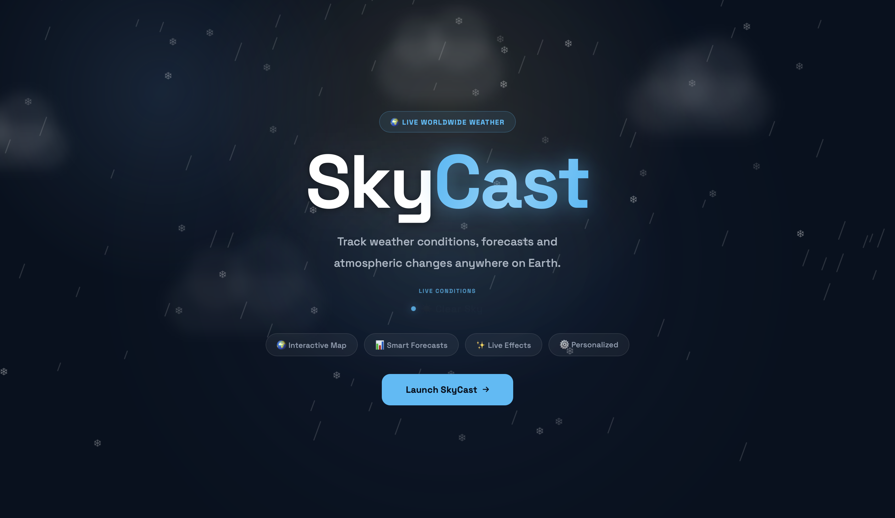

---

### Dashboard (Dark Theme)

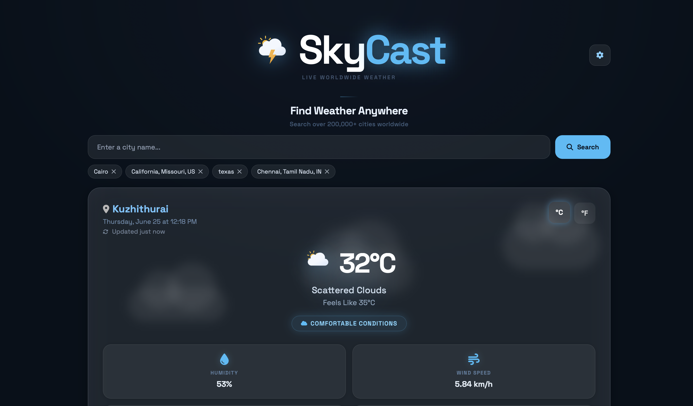

---

### Dashboard (Light Theme)

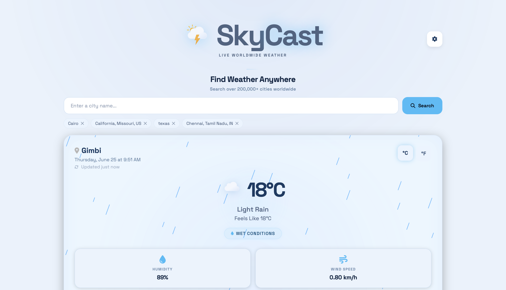

---

### Weekly Forecast

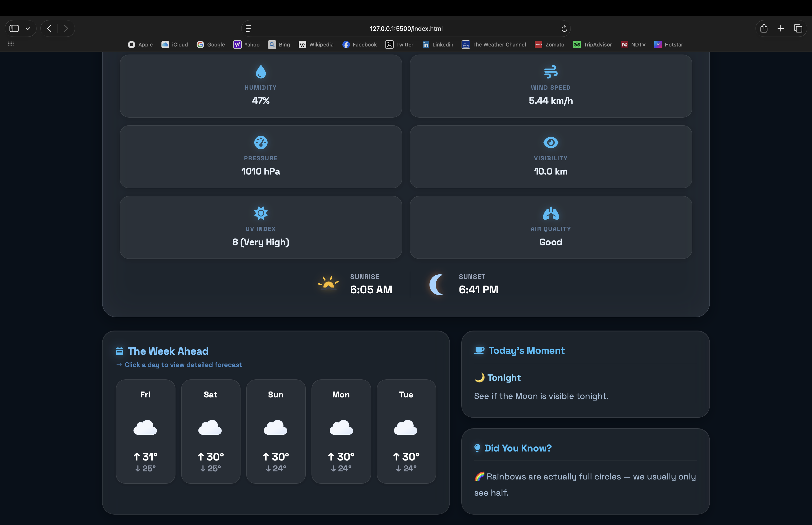

---

### Weekly Forecast (Light Theme)

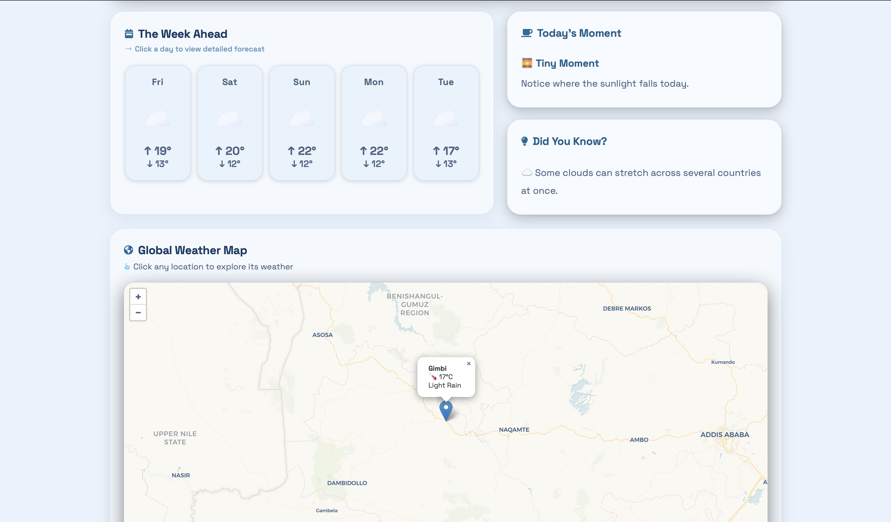

---

### Today & Tonight

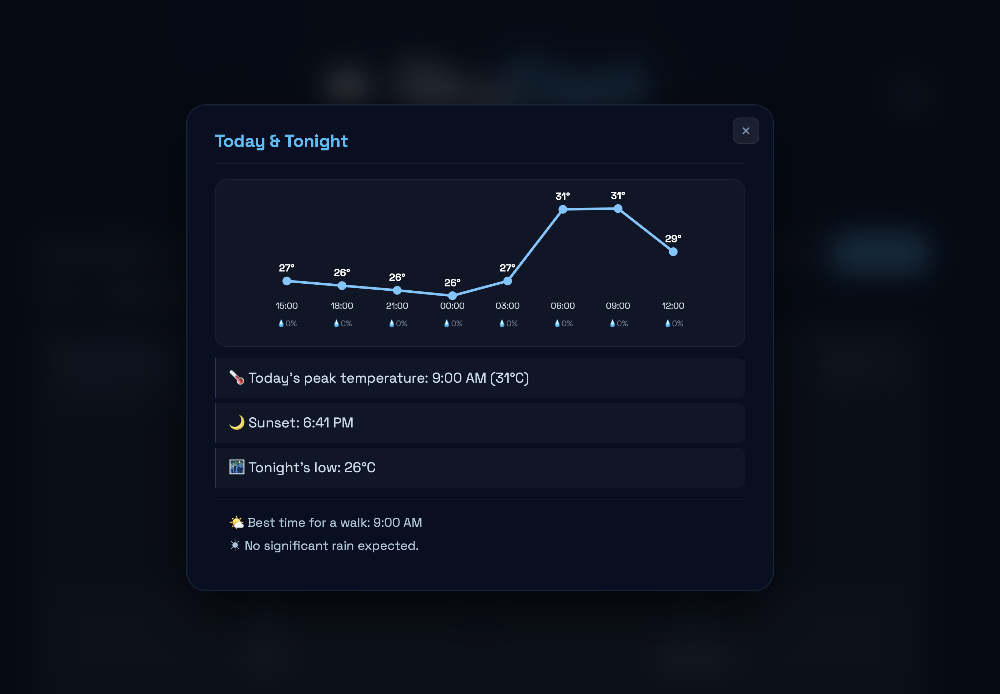

---

### Week Ahead Cards

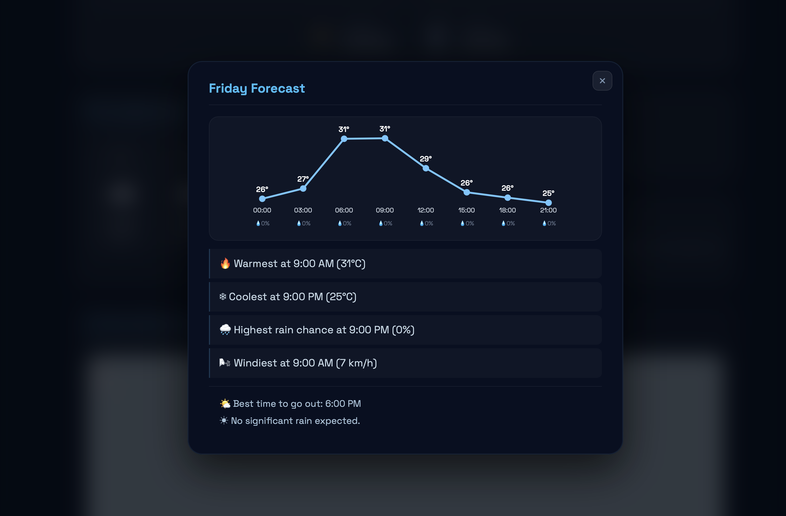

---

### Interactive Weather Map

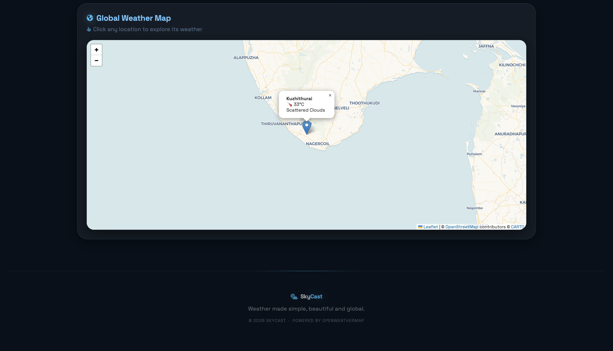

---

### Settings Panel

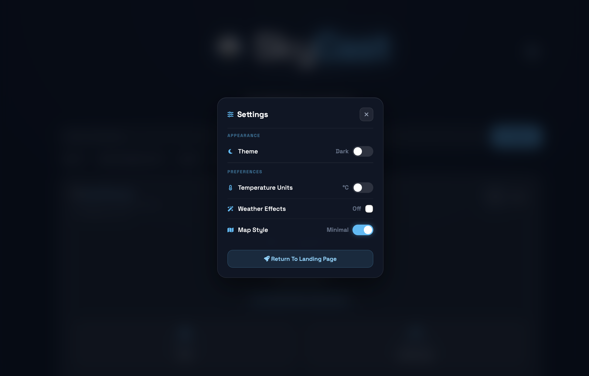

---

### Mobile View - Landing Page

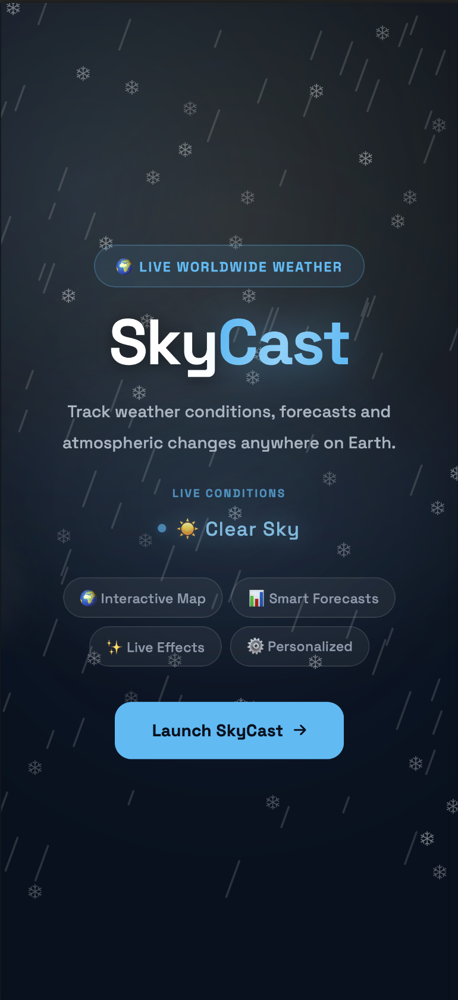

---

### Mobile View - Dashboard

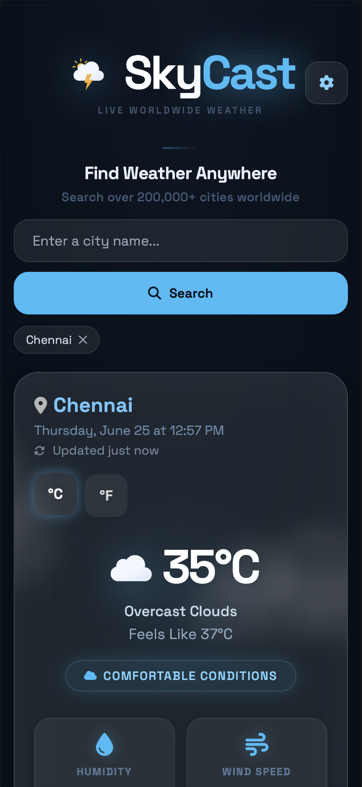

---

## Documentation

The repository includes detailed project documentation covering the project overview, features, technologies used, implementation details, screenshots, and future enhancements.<br>
[View Documentation](documentation/SkyCast_documentation.pdf)

---

## Future Enhancements

- Severe weather alerts and notifications
- Weather history and analytics
- Multi-language support
- Progressive Web App (PWA)
- Weather widgets for quick access
- Offline caching support

---

## Author

**Adlin A**